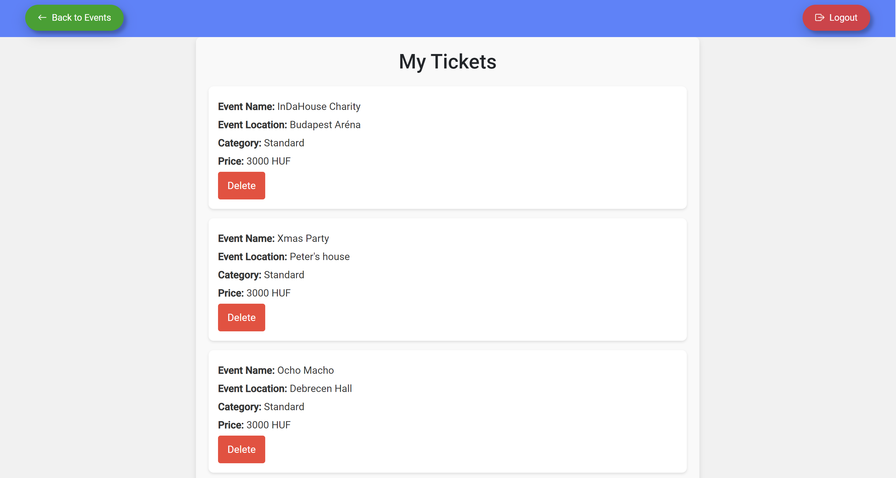
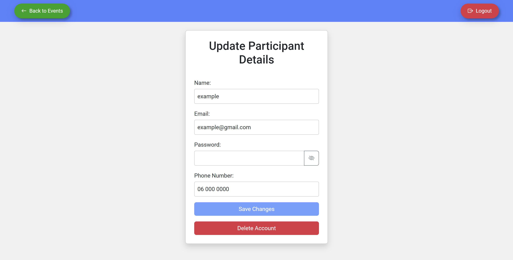

# Event Organizer
This is an Event Organizer web application built as part of a university project. It provides a simple platform for managing events, including basic CRUD operations. Additionally, users can create, view, update, delete events, search for events with various filters, buy tickets for events, view, delete their tickets,  view, update, delete their accounts.

## Events page example:


## MyTickets page example:


## Participant page example:


# Usage:
- ### User Registration: New users can register by providing their name, email, and password.
- ### Login: After registration, users can log in using their credentials.
- ### Event Management: Event creators can add new events, edit existing ones, or delete events.
- ### Ticket Management: Users can buy tickets for events and view and delete their purchased tickets under the "My Tickets" section.
- ### Filters: The event list can be filtered by event name, location, and date range
- ### Users can change their data (name, email, password, phone number) or even delete their account, under the "My Account" section.

# Installation Instructions:
### 1.  Clone the repository to your local machine.
### 2. Install dependencies: ``` npm install```
### 3.  Run the backend server (Spring Boot):
  - ### Use ```mvn spring-boot:run``` to start the backend server in IntelliJ IDEA.
### 4. Run the frontend:
  - ### Use ```ng serve``` to start the frontend development server.
### 5. Open your browser and navigate to ```http://localhost:4200``` to access the application.

# Technologies Used:
- ### Frontend: Angular
- ### Backend: Java (Spring Boot)
- ### Database: h2Database
- ### Authentication: JWT (JSON Web Tokens)
- ### UI: Bootstrap, Material Design Components
